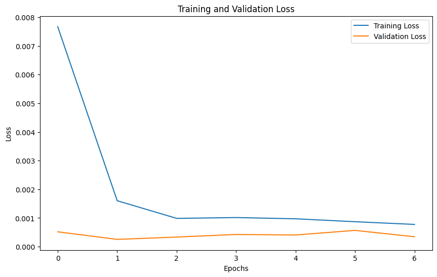
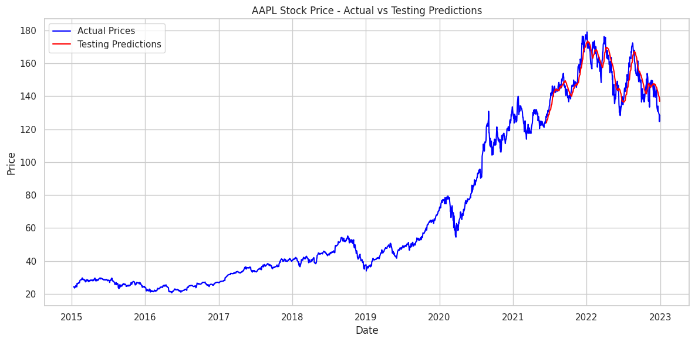

# CodeAlpha_Stock_Price_Prediction_LSTM

# Stock Price Prediction Using LSTM

This project aims to predict stock prices using historical data and a Long Short-Term Memory (LSTM) model.

## Features
- Advanced preprocessing and feature engineering
- Sequential data modeling with LSTM
- Validation using MSE and MAE metrics
- Visualizations including correlation matrix, loss curves, and predictions

## Results
- Training MSE: 3870.83
- Testing MSE: 27.18
- Training MAE: 52.65
- Testing MAE: 4.07

## Visuals
- Correlation Matrix  
  
- Loss Curves  
  
- Prediction Plot  
  

## How to Run
1. Install the required libraries:
